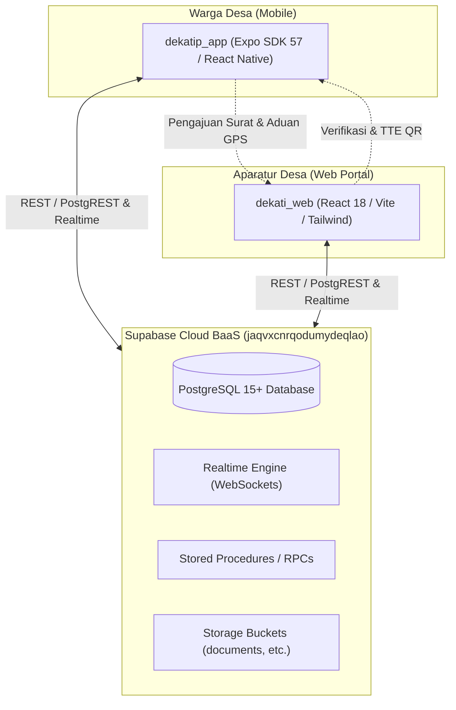

# LAPORAN PEMERIKSAAN DAN AUDIT SISTEM TERPADU "DEKATI"
**Proyek:** `dekati_web` (Portal Web Administrasi Desa) & `dekatip_app` (Aplikasi Mobile Warga)  
**Waktu Pemeriksaan:** 07 Oktober 2026  
**Status Audit:** Selesai (Analisis Kode Sumber, Arsitektur, Basis Data, Keamanan, Pengujian & UX)

---

## 1. Ringkasan Eksekutif (Executive Summary)

Platform **DEKATI** (*Desa Komunikasi & Administrasi Terintegrasi / Desa Kita Dekat di Hati*) adalah ekosistem digital terpadu pelayanan publik tingkat desa/kelurahan yang terdiri atas dua komponen utama:
1. **`dekati_web`**: Aplikasi web berbasis React 18, Vite, dan Tailwind CSS untuk Pamong/Aparatur Desa (Admin Desa, Sekretariat, dan Kepala Desa) guna verifikasi berkas, persetujuan Tanda Tangan Elektronik (TTE) QR, pengelolaan APBDes, disposisi pengaduan, agenda, dan pemantauan warga.
2. **`dekatip_app`**: Aplikasi mobile berbasis Expo SDK 57, React Native 0.86, React 19, dan Expo Router untuk warga desa guna permohonan e-surat, tracking berkas, pelaporan aduan dengan GPS & foto kamera, transparansi anggaran, kontak siaga darurat, dan manajemen profil keluarga.

Keduanya terhubung secara interoperabel melalui backend **Supabase PostgreSQL** dengan sinkronisasi **Realtime WebSocket (postgres_changes)** dan fallback offline lokal.

### Skor Evaluasi Keseluruhan: **7.3 / 10**
| Kategori Evaluasi | Skor (1 - 10) | Status | Keterangan Singkat |
| :--- | :---: | :---: | :--- |
| **Desain UI/UX & Interaktivitas** | **9.0** | ⭐ Sangat Baik | Antarmuka modern (Bento Grid), micro-interactions halus, tata letak rapi, konsisten. |
| **Kesiapan Fitur (Feature Completeness)** | **8.5** | ⭐ Sangat Baik | E-Surat TTE QR, Aduan GPS, APBDes kalkulasi dinamis, Kontak Darurat, Agenda. |
| **Sinkronisasi Realtime & Data** | **8.2** | 👍 Baik | Skema database tersinkronisasi, realtime channel aktif, fallback offline bekerja. |
| **Kompilasi & Build Health** | **9.5** | ⭐ Sangat Baik | Web: Vite build sukses; Mobile: 0 error TypeScript (`tsc --noEmit`); Unit test pass. |
| **Arsitektur Kode & Modularitas** | **6.8** | ⚠️ Perlu Refactor | Web sangat modular; Mobile memiliki file monolitik raksasa (>2.900 baris). |
| **Keamanan & Privasi Data (UU PDP)** | **5.5** | 🚨 Kritis | Paradoks RLS Supabase custom-auth, NIK terekspos di lacak publik web, filter client-side. |
| **Alur Autentikasi & Registrasi** | **6.0** | ⚠️ Butuh Perbaikan | Registrasi mobile mengirim password kosong; sesi mobile tidak persisten saat tutup aplikasi. |

---

## 2. Profil Teknis Kedua Proyek



### A. Spesifikasi `dekati_web`
* **Direktori:** `F:\AllDataVsCode2\dekati_web`
* **Framework:** React 18.3.1 + Vite 6.0.7 + TypeScript 5.6.3
* **Styling & UI:** Tailwind CSS 3.4.17 + PostCSS + Lucide React (0.475.0)
* **Routing:** React Router DOM 7.18.4
* **Testing:** Vitest 5.0.3 (Hasil: **5 passed / 1 test suite**)
* **Build Status:** **PASS** (`tsc -b && vite build` selesai dalam 13.74s)
* **Karakteristik Arsitektur:** 
  - Struktur komponen modular terpisah rapi (`src/views/landing/`, `src/components/`, `src/layouts/`, `src/services/`).
  - Menggunakan dialog modal berbasis `createPortal` untuk mencegah masalah *clipping* atau z-index.
  - Public Landing Page terpisah dengan portal login Pamong Desa.

### B. Spesifikasi `dekatip_app`
* **Direktori:** `F:\AllDataVsCode2\dekatip_app`
* **Framework:** Expo SDK ~57.0.9 + React Native 0.86.2 + React 19.2.3 + TypeScript 6.0.3
* **Routing:** Expo Router ~57.0.12 (File-based routing)
* **Native Modules:** `expo-camera`, `expo-location`, `expo-image-picker`, `expo-print`, `expo-sharing`
* **Testing:** Vitest 5.0.3 (Hasil: **7 passed / 2 test suites**)
* **Typecheck Status:** **PASS** (`npx tsc --noEmit` bersih, 0 errors)
* **Karakteristik Arsitektur:**
  - Desain antarmuka Bento dengan tipografi Nunito.
  - Layanan API modular di `services/api/` (`citizenService`, `letterService`, `complaintService`, dll).
  - Terdapat dokumentasi perancangan lengkap di folder `docs/` (`api_architecture.md`, `database_design.md`, `openapi.yaml`).

---

## 3. Matriks Komparasi Fitur & Interoperabilitas

| Fitur Utama | `dekati_web` (Pamong) | `dekatip_app` (Warga) | Sinkronisasi Supabase | Status Evaluasi |
| :--- | :---: | :---: | :---: | :--- |
| **Buku Induk Kependudukan** | Manajemen lengkap, validasi NIK/KK, ekspor CSV | Manajemen profil & anggota keluarga (KK yang sama) | `citizens` table | ✅ Terhubung |
| **Verifikasi Identitas Akun** | Review foto fisik KTP & swafoto, approve/revisi | Upload foto KTP & swafoto pegang KTP | `citizens` + Storage | ⚠️ File bucket perlu dicek hak aksesnya |
| **Layanan E-Surat** | Disposisi, verifikasi berkas, pengesahan TTE Kades | Katalog jenis surat, formulir, upload lampiran | `letter_requests` | ⚠️ Query mobile menarik seluruh surat lalu filter lokal |
| **TTE Surat QR Code** | Terbit No. Registrasi, generate token & URL QR | Tampil barcode QR & riwayat timeline progres | `letter_requests` | ✅ Sempurna & konsisten |
| **Cetak Fisik PDF Surat** | Modal cetak resmi berstempel & QR validasi | Fitur preview detail surat & tracking status | `letter_print_modal` | ✅ Bekerja dengan baik |
| **Aduan & Aspirasi Warga** | Peta koordinat GPS, foto kerusakan, tindak lanjut | Form aduan, GPS auto-detect, kamera multi-foto | `complaints` | ⚠️ Foto jamak disimpan sbg string koma/JSON di text |
| **Transparansi APBDes** | Manajemen mata anggaran belanja/pendapatan, kalkulasi dinamis | Ringkasan grafik realisasi anggaran desa | `apbdes_items` | ⚠️ Web melakukan `delete().neq('id', 0)` saat simpan |
| **Warta & Pengumuman** | Buat siaran, status darurat/penting, filter target | Banner siaran darurat, popup modal, tanda sudah dibaca | `announcements` | ✅ Sinkron Realtime |
| **Kontak Siaga 24 Jam** | CRUD nomor darurat, urutan prioritas | Panggilan langsung satu klik (telepon/WA) | `emergency_contacts` | ✅ Sinkron Realtime |
| **Agenda Kegiatan Desa** | Buat/edit jadwal rapat, posyandu, gotong royong | Kalender agenda, modal detail, lokasi kegiatan | `village_events` | ✅ Sinkron Realtime |
| **Lacak Mandiri Tanpa Login** | Widget lacak resi di landing page publik | Melalui menu tab Lacak Surat | `letter_requests` | 🚨 NIK pemohon terekspos tanpa sensor (UU PDP) |

---

## 4. Temuan Kritis (Detailed Issues & Vulnerabilities)

### 🔴 Temuan 1 (Kritis): Gap Fatal Alur Registrasi Warga & Autentikasi
* **Lokasi:** 
  - `dekatip_app/app/(auth)/register.tsx` (baris 88)
  - `dekatip_app/services/auth.ts` (baris 106–122)
  - `dekati_web/supabase_schema.sql` (baris 460–486)
* **Uraian Masalah:**
  1. Pada formulir `register.tsx` di mobile app, warga memasukkan NIK, Nama, No KK, Telepon, dan Alamat, tetapi **tidak ada input kata sandi (password)**. Kode secara eksplisit mem-pass parameter `password: ''`.
  2. File `services/auth.ts` mem-bypass fungsi RPC `register_citizen` (karena fungsi tersebut memang sengaja di-disable dengan `RAISE EXCEPTION` di database) dan langsung melakukan `supabase.from('citizens').insert(...)`.
  3. Dalam insert tersebut, kolom `password_hash` dibiarkan `NULL`.
  4. Ketika warga mencoba login di `login.tsx`, sistem memanggil RPC `authenticate_citizen(p_nik, p_password)`. Fungsi ini memverifikasi:
     ```sql
     IF v_cit.password_hash IS NOT NULL AND v_cit.password_hash = crypt(p_password, v_cit.password_hash)
     ```
     Karena `password_hash` bernilai `NULL`, **warga yang mendaftar baru tidak akan pernah bisa login sama sekali**, bahkan setelah diverifikasi oleh admin desa!
  5. Pada sisi `dekati_web`, admin hanya memiliki tombol "Setujui" atau "Minta Revisi", tanpa fitur untuk men-generatekan atau me-reset kata sandi warga.

---

### 🔴 Temuan 2 (Kritis): Paradoks Keamanan Supabase Custom Auth vs Row Level Security (RLS)
* **Lokasi:**
  - `dekati_web/database/migration_security_lockdown.sql`
  - `dekati_web/src/services/dataService.ts`
  - `dekatip_app/services/api/citizenService.ts`
* **Uraian Masalah:**
  1. Sistem Dekati menggunakan arsitektur otentikasi kustom berbasis RPC (`authenticate_official` dan `authenticate_citizen`) yang mengembalikan data pengguna langsung ke memori aplikasi.
  2. Sistem **TIDAK menggunakan Supabase Auth bawaan** (`supabase.auth.signInWithPassword`), sehingga sesi Supabase (`supabase.auth.getSession()`) bernilai `null` dan client tetap memegang peranan database `role = 'anon'`.
  3. Konsekuensinya:
     - Jika file `migration_security_lockdown.sql` dieksekusi (`REVOKE ALL ON TABLE public.citizens FROM PUBLIC, anon, authenticated;`), seluruh fungsi pembacaan dan pembaruan data oleh Web Admin maupun Mobile App Warga **akan lumpuh seketika** dengan pesan kesalahan Postgres:
       ```
       code: '42501', message: 'permission denied for table citizens'
       ```
       *(Hal ini telah terbukti muncul pada log saat pengujian Vitest `citizenService.test.ts`)*.
     - Sebaliknya, jika RLS dibuka/diberi akses kepada `anon`, siapapun yang mengetahui `VITE_SUPABASE_ANON_KEY` (yang tersimpan di bundle client) dapat mengakses dan memodifikasi data warga melalui API Supabase secara bebas tanpa autentikasi.

---

### 🟠 Temuan 3 (Privasi / Hukum): Kebocoran NIK Lengkap di Halaman Publik
* **Lokasi:** `dekati_web/src/views/landing/LetterTrackingSection.tsx` (baris 148)
* **Uraian Masalah:**
  Pada fitur "Lacak Status Surat Tanpa Perlu Login" di halaman utama web, setelah nomor resi dimasukkan (atau tombol contoh demo diklik), halaman langsung menampilkan:
  ```tsx
  Pemohon: <strong>{trackedLetter.citizen_name}</strong> (NIK: {trackedLetter.citizen_nik})
  ```
  Menampilkan NIK 16 digit secara terbuka ke publik pada halaman yang tidak membutuhkan login berisiko melanggar **UU Perlindungan Data Pribadi (UU PDP No. 27 Tahun 2022)**. NIK wajib disamarkan (*masked*), misalnya: `320101******0005`.

---

### 🟠 Temuan 4 (Keamanan & Efisiensi): Query `SELECT *` Seluruh Surat Warga di Mobile
* **Lokasi:** `dekatip_app/services/api/letterService.ts` (baris 129–143)
* **Uraian Masalah:**
  Untuk menampilkan daftar riwayat surat pada menu warga, aplikasi mobile menjalankan:
  ```ts
  const { data, error } = await supabase
    .from('letter_requests')
    .select('*')
    .order('created_at', { ascending: false });

  if (!error && data && Array.isArray(data)) {
    filteredData = data.filter((d: any) => {
      if (d.citizen_nik && familyNiks.has(d.citizen_nik)) return true;
      ...
  ```
  Aplikasi menarik **seluruh data pengajuan surat dari seluruh warga desa** dari database ke perangkat pengguna, baru kemudian memfilternya di JavaScript memori lokal ponsel.
  - **Risiko Privasi:** Perangkat pengguna mengunduh data sensitif warga lain (alasan permohonan SKTM, nomor kontak, dsb).
  - **Pemborosan Kuota/Kinerja:** Jika desa memiliki 10.000 riwayat surat, aplikasi akan melambat secara signifikan dan menguras kuota internet warga.
  - **Solusi:** Filter harus dilakukan di level query database: `.in('citizen_nik', Array.from(familyNiks))` atau menggunakan parameter ID pengguna.

---

### 🟡 Temuan 5 (Pengalaman Pengguna / UX): Sesi Login Mobile Tidak Persisten
* **Lokasi:** `dekatip_app/services/auth.ts` (baris 30–45) dan `dekatip_app/app/index.tsx` (baris 12–25)
* **Uraian Masalah:**
  Pada `services/auth.ts`, terdapat logika:
  ```ts
  // Sessions live only in memory and are never restored from user-controlled storage.
  let currentActiveCitizen: Citizen | null = null;
  let inMemorySession: CitizenSession | null = null;

  export const auth = {
    async getStoredSession(): Promise<CitizenSession | null> {
      if (inMemorySession) return inMemorySession;
      try {
        await AsyncStorage.removeItem(SESSION_STORAGE_KEY);
      } catch (error) { ... }
      return null;
    }
  ```
  Setiap kali aplikasi mobile ditutup dari background (*killed / restarted*), memori JavaScript hilang. Saat aplikasi dibuka kembali, `getStoredSession()` selalu mengembalikan `null` dan menghapus `AsyncStorage`. Akibatnya, **warga dipaksa untuk mengetik 16 digit NIK dan kata sandi setiap kali membuka aplikasi**. Pada aplikasi mobile publik, hal ini sangat menurunkan retensi pengguna.

---

### 🟡 Temuan 6 (Integritas Data): Operasi Hapus Total `apbdes_items` saat Pembaruan
* **Lokasi:** `dekati_web/src/services/dataService.ts` (baris 834–836)
* **Uraian Masalah:**
  Saat admin menyimpan item anggaran APBDes di web:
  ```ts
  await supabase.from('apbdes_items').delete().neq('id', 0); // clear all
  ...
  await supabase.from('apbdes_items').insert(rowsToInsert);
  ```
  Aplikasi menghapus **seluruh baris** di tabel `apbdes_items` lalu melakukan insert ulang.
  - Jika terdapat data riwayat APBDes lintas tahun anggaran (misal: 2024, 2025, 2026), seluruh tahun lain akan ikut terhapus.
  - Jika terjadi gangguan jaringan tepat setelah `delete()`, data APBDes desa akan kosong total.
  - Operasi seharusnya menggunakan klausa `WHERE fiscal_year = ...` atau operasi `upsert`.

---

### 🟡 Temuan 7 (Struktur Basis Data): Multi-Foto Aduan Disimpan sebagai String di Kolom `TEXT`
* **Lokasi:** 
  - `dekati_web/supabase_schema.sql` (baris 112)
  - `dekatip_app/services/api/complaintService.ts` (baris 48–62)
* **Uraian Masalah:**
  Di skema database, kolom `photo_url` didefinisikan sebagai `TEXT`. Namun aplikasi mobile mendukung pengunggahan multi-foto (hingga 3 foto kerusakan). Pengembang mengakalinya dengan menggabungkan string URL dengan koma atau format JSON `["url1", "url2"]` ke dalam satu kolom teks tersebut. Ini menyulitkan query SQL, validasi relasi, dan manipulasi data di backend.

---

### 🟡 Temuan 8 (Arsitektur & Pemeliharaan): Komponen Monolitik Raksasa di Mobile
* **Lokasi:**
  - `dekatip_app/app/(tabs)/profil.tsx` (**2.980 baris**)
  - `dekatip_app/app/(tabs)/index.tsx` (**1.973 baris**)
  - `dekatip_app/app/complaints/create.tsx` (**864 baris**)
  - `dekatip_app/app/letters/create.tsx` (**773 baris**)
* **Uraian Masalah:**
  File-file di atas menggabungkan seluruh modal (Edit Profil, Tambah Anggota Keluarga, Upload KTP, Preview Multi-Foto), state manajemen form, stylesheet raksasa, dan logika komunikasi API ke dalam satu file tunggal. Hal ini menyulitkan *code review*, memperbesar risiko regresi bug saat pengeditan, dan memperlambat waktu respons editor IDE. Sebaiknya dipecah menjadi subkomponen seperti yang telah berhasil diterapkan pada `dekati_web`.

---

### 🟡 Temuan 9 (DevOps & Kebersihan Git): `.env` Belum Masuk `.gitignore` di `dekati_web`
* **Lokasi:** `dekati_web/.gitignore`
* **Uraian Masalah:**
  Di `dekati_web/.gitignore`, entri `.env` dan `.env.local` **tidak tercantum**. File `.env` saat ini berstatus *Untracked* di git. Jika seorang pengembang menjalankan perintah `git add .`, file `.env` yang berisi kredensial Supabase akan otomatis ter-commit ke repositori GitHub.

---

## 5. Penilaian & Evaluasi Mendalam

```
RANGKUMAN PENILAIAN INDEKS DEKATI
────────────────────────────────────────────────────────────────
UI/UX & Desain Visual       : [█████████░] 9.0 / 10 (Modern, Bento, Bersih)
Kelengkapan Fitur Desa      : [████████▌░] 8.5 / 10 (Sangat Lengkap & Relevan)
Stabilitas Build & Typing   : [█████████▌] 9.5 / 10 (0 Error TypeScript)
Modularitas Kode Web        : [████████▌░] 8.5 / 10 (Rapi & Terstruktur)
Modularitas Kode Mobile     : [█████░░░░░] 5.5 / 10 (Perlu Dekomposisi)
Keamanan & Privasi Data     : [█████▌░░░░] 5.5 / 10 (Perlu Restrukturisasi Auth)
────────────────────────────────────────────────────────────────
RATA-RATA TOTAL             : [███████▍░░] 7.3 / 10 (SIAP KE TAHAP MATANG)
```

### Kelebihan Utama (Strengths):
1. **Desain Visual & Identitas Sangat Kuat**: Menggunakan paradigma desain modern (Bento Grid, micro-interactions, badge status warna presisi, tipografi Nunito yang ramah untuk warga).
2. **Kesesuaian dengan Regulasi & Kebutuhan Nyata Desa**: Fitur yang dibangun sangat membumi dan sesuai regulasi pemerintahan desa di Indonesia (TTE QR Kades, No. Registrasi Desa, APBDes Pendapatan/Belanja, Kontak Siaga Satlinmas/Bhabinkamtibmas, Posyandu).
3. **Fitur Pelacakan Surat Tanpa Login**: Sangat mempermudah warga desa yang enggan mendownload aplikasi mobile untuk memantau surat secara transparan via browser web.
4. **Kualitas Tipe Data & TypeScript Prima**: Baik proyek Web maupun Mobile berhasil melalui pengujian kompilasi tipe data tanpa ada error (`0 errors`).
5. **Dukungan Pengaduan Presisi**: Mendukung koordinat GPS (latitude/longitude) langsung dari sensor perangkat dan link instan ke Google Maps untuk tim lapangan desa.

### Kekurangan Utama (Weaknesses):
1. **Model Autentikasi Menggantung**: Antara BaaS Supabase Auth standar dengan Custom Stored Procedure (RPC) belum menyatu secara matang.
2. **Kerentanan Akses Tabel**: Seluruh operasi client bergantung pada anon key dengan izin tabel yang terbuka.
3. **Ketiadaan Kata Sandi pada Registrasi Warga**: Membuat proses registrasi mandiri warga saat ini menjadi *dead-end*.

---

## 6. Rekomendasi & Rencana Tindak Lanjut (Actionable Recommendations)

### Tahap 1: Perbaikan Segera (Urgent / Hotfix - Pekan 1)
1. **Amankan `.gitignore` di `dekati_web`:**
   Tambahkan segera baris berikut ke `dekati_web/.gitignore`:
   ```gitignore
   .env
   .env.local
   .env.*.local
   ```
2. **Sensor (Masking) NIK di Lacak Surat Publik Web:**
   Ubah tampilan NIK di `dekati_web/src/views/landing/LetterTrackingSection.tsx`:
   ```tsx
   // Sebelum: (NIK: {trackedLetter.citizen_nik})
   // Sesudah:
   (NIK: {trackedLetter.citizen_nik ? trackedLetter.citizen_nik.slice(0, 6) + '******' + trackedLetter.citizen_nik.slice(12) : '-'})
   ```
3. **Perbaiki Alur Input Kata Sandi pada Registrasi Mobile:**
   - Tambahkan input Password & Konfirmasi Password pada `dekatip_app/app/(auth)/register.tsx`.
   - Di sisi database/RPC, buat fungsi `register_citizen_secure` yang menerima password dan mengenkripsinya dengan `crypt(p_password, gen_salt('bf', 8))`.
4. **Batasi Query Surat di Mobile ke Data Keluarga Pemohon:**
   Ubah query di `dekatip_app/services/api/letterService.ts`:
   ```ts
   let query = supabase.from('letter_requests').select('*');
   if (familyNiks.size > 0) {
     query = query.in('citizen_nik', Array.from(familyNiks));
   }
   const { data, error } = await query.order('created_at', { ascending: false });
   ```

### Tahap 2: Refactoring & Keamanan (Pekan 2 - 3)
1. **Penyimpanan Sesi Aman di Mobile (`expo-secure-store`):**
   - Simpan token sesi warga di penyimpanan aman perangkat (`expo-secure-store` atau `AsyncStorage` dengan enkripsi token).
   - Jangan menghapus sesi saat aplikasi ditutup; sediakan opsi login biometrik (Fingerprint/FaceID) atau auto-login dengan validasi token ke backend.
2. **Pecah File Monolitik Mobile:**
   - Dekomposisi `app/(tabs)/profil.tsx` (2.980 baris) menjadi:
     - `components/profile/FamilyMemberList.tsx`
     - `components/profile/EditProfileModal.tsx`
     - `components/profile/AddFamilyMemberModal.tsx`
     - `components/profile/VerifyIdentityModal.tsx`
   - Dekomposisi `app/(tabs)/index.tsx` (1.973 baris) menjadi modul-modul kartu terpisah (`EmergencyCard`, `UrgentBannerModal`, `ApbdesSummaryCard`, dll).
3. **Perbaiki Penanganan Multi-Foto Aduan:**
   - Tambahkan kolom `photo_urls JSONB DEFAULT '[]'::jsonb` di tabel `complaints`.
   - Gunakan format array JSON murni daripada string gabungan koma.
4. **Amankan Update APBDes:**
   Ubah logika `delete().neq('id', 0)` menjadi:
   ```ts
   await supabase.from('apbdes_items').delete().eq('fiscal_year', updatedApbdes.fiscal_year);
   ```
   Sehingga data anggaran tahun-tahun sebelumnya tidak ikut terhapus.

### Tahap 3: Produksi Skala Luas & Skalabilitas (Pekan 4+)
1. **Migrasi ke Supabase Auth Resmi atau Backend API Terdedikasi:**
   Gunakan Supabase Auth berbasis JWT sehingga setiap warga dan pamong memiliki token JWT otentik. Dengan JWT, Row Level Security (RLS) PostgreSQL dapat diterapkan secara ketat:
   ```sql
   CREATE POLICY "Warga hanya bisa melihat surat keluarganya"
   ON public.letter_requests FOR SELECT
   TO authenticated
   USING (citizen_nik = auth.jwt() ->> 'nik');
   ```
2. **Integrasi Layanan WhatsApp Gateway Resmi (Fonnte / Twilio):**
   Kirim notifikasi otomatis ke nomor WhatsApp warga setiap kali status surat berubah (*Misal: "Surat Keterangan Usaha Anda telah ditandatangani Kepala Desa dan siap diambil/diunduh"*).
3. **Penyimpanan Dokumen Private (Signed URLs):**
   Atur bucket `documents` di Supabase Storage menjadi *Private*. Buat *Signed URL* berbatas waktu (misal: 15 menit) saat pamong memeriksa foto KTP/KK warga untuk mencegah kebocoran dokumen kependudukan.

---

## 7. Kesimpulan Akhir

Proyek **DEKATI** (`dekati_web` dan `dekatip_app`) adalah produk sistem informasi desa yang **sangat impresif, fungsional, dan memiliki nilai guna tinggi bagi masyarakat**. Estetika antarmuka, kelengkapan alur layanan desa, serta performa kompilasinya berada pada standar industri yang prima.

Kelemahan terbesar saat ini berpusat pada **alur pendaftaran akun baru pada aplikasi mobile** dan **paradoks keamanan hak akses database Supabase** yang belum terlindungi oleh session JWT terverifikasi.

Dengan menerapkan rekomendasi perbaikan pada **Tahap 1** dan **Tahap 2** di atas, ekosistem DEKATI akan siap secara penuh untuk diimplementasikan secara resmi di kantor desa / kelurahan nyata dengan tingkat keandalan, kepatuhan hukum, dan keamanan data yang sangat tinggi.
